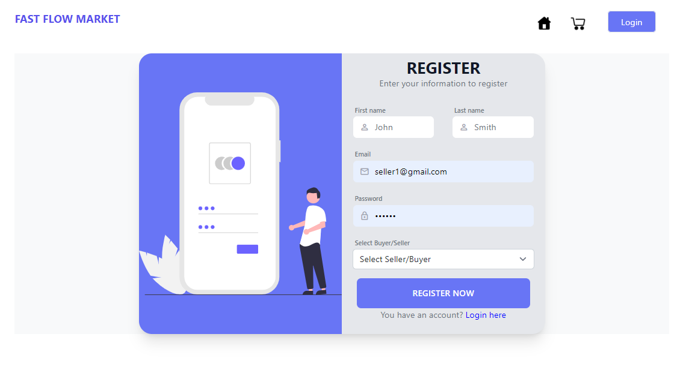
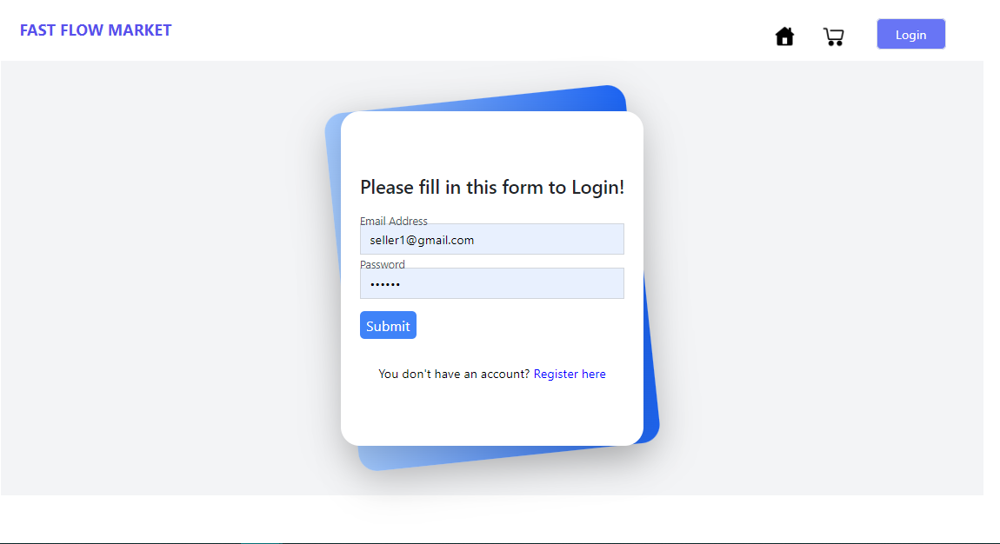
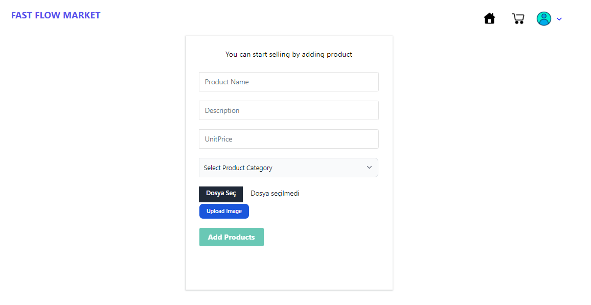
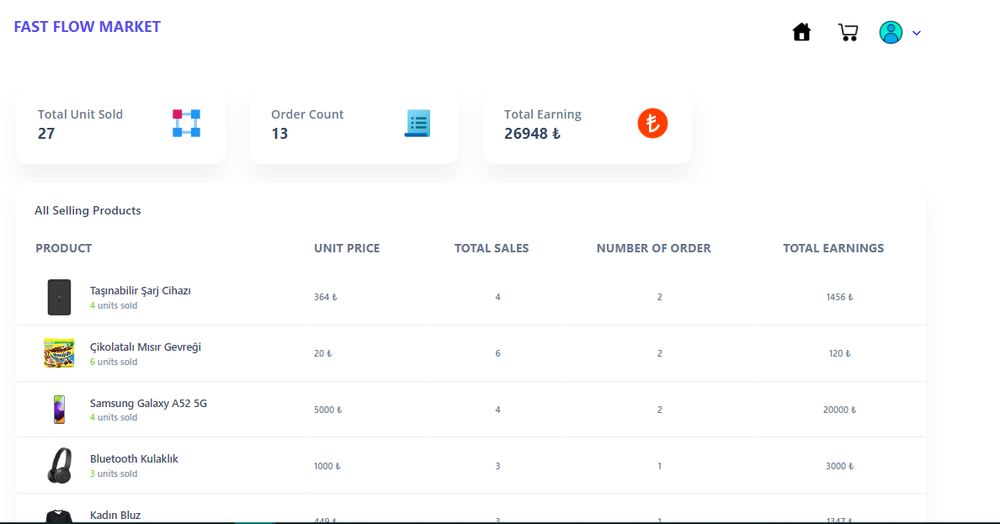
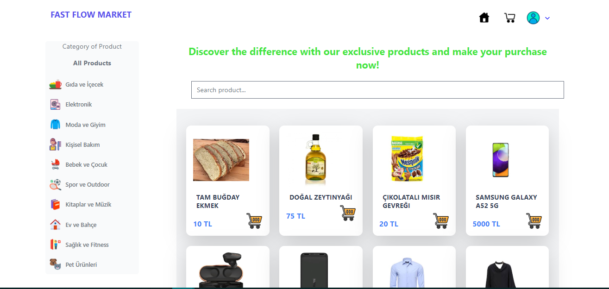
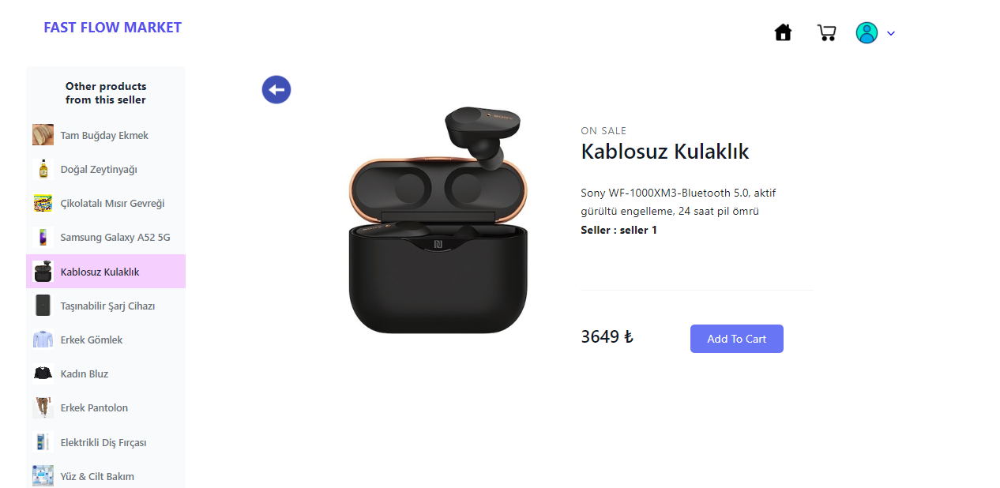
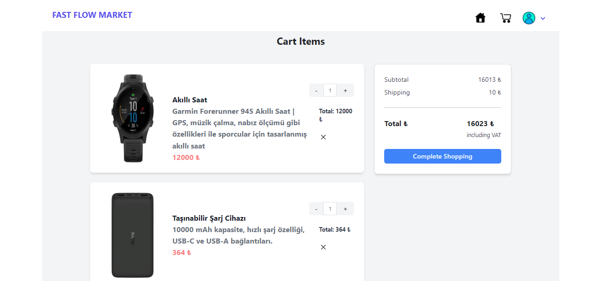
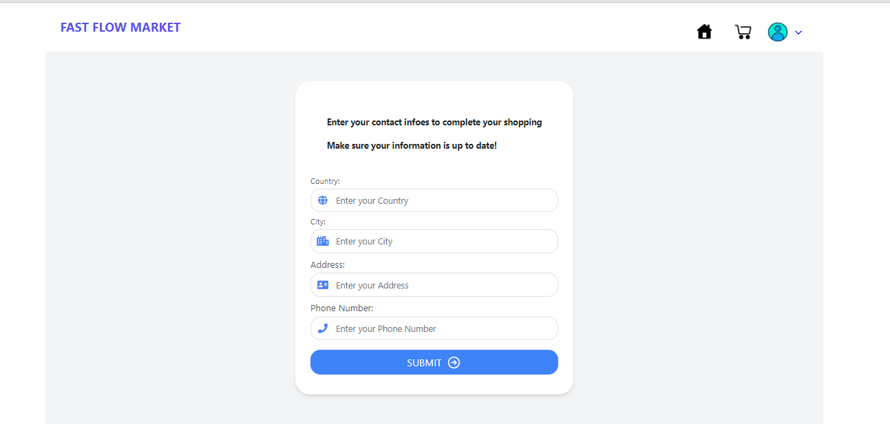
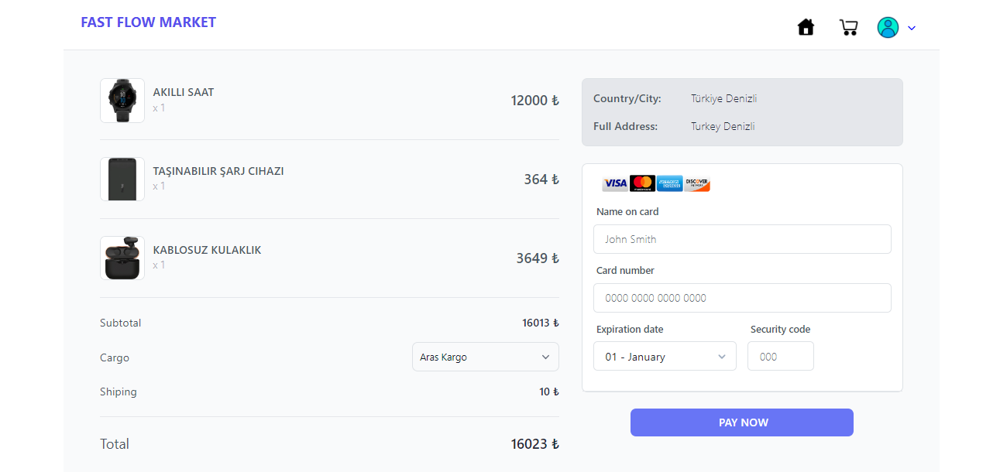
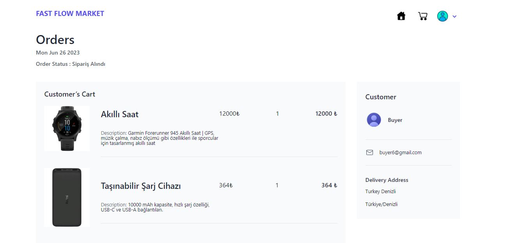

### PROJECT AND USED TECHNOLOGIES
Fast Flow Market is a comprehensive e-commerce project. In this project, a platform was created where customers can easily find and purchase products. The project has been developed as a full stack solution, that is, it includes database, backend and frontend components.

MS SQL Server was used as database. MS SQL Server is a powerful and scalable relational database management system. The database was used as a central data repository where products, customers, orders and other relevant information are stored. In this way, all transactions are carried out through the database and the security and integrity of the data is ensured.

.NET Core is used on the backend. .NET Core is a high-performance, portable and scalable application development platform. .NET Core includes the core components of Fast Flow Market that manages business logic and database operations. Implementation of many features such as listing of products, management of user accounts, payment processing and other functions have been implemented with .NET Core. In this way, a reliable, fast and customizable backend solution is presented.

Angular technology is used on the frontend. Angular is a powerful JavaScript framework for web applications. Fast Flow Market's user interface was created with Angular and a feature-rich user experience was provided. The user-friendly presentation of important functions such as searching for products, filtering, adding to cart, and paying has been achieved with Angular.

Fast Flow Market is designed as a comprehensive project that offers a secure and user-friendly e-commerce experience where users can shop easily. Its development as a full stack solution has enabled the database, backend and frontend components to work integrated with each other and a seamless shopping platform has been created for users.
Link of Backend codes : <https://github.com/eyupduran/Fast-Flow-Market-Be>

### INTRODUCTION OF THE PROJECT

There are two types of user roles in this project. The first type of users are the so-called "sellers". These users can add their own products and view their sales statistics. Other types of users are called "buyers". These users can see the products, product category menu and product details on the home page.

The product categories menu allows the user to filter products by categories. In this way, users can more easily access products in the categories they are interested in. On the product detail page, users can learn more about the product they selected. In addition, other products of the relevant product's seller are listed in the side menu of the page. This feature allows the user to discover other products from the same seller and potentially encourages them to buy more.

Users can add the products they like to the cart and see the cart details. In the basket detail, users can change the number of related products. After giving the cart confirmation, users are directed to the address information page to enter their address information. After entering the address information, they are directed to the payment page. The payment page contains the details of the products for which the cart approval is given and the card information to which the payment will be made. In addition, users can choose which shipping company they want to send their orders with. After confirming the payment information, the user's order is created.

Users can see order details and order status on the order page. In this way, users can track their orders and learn their current status. This flow enriches the user's shopping experience and allows the user to manage the ordering process step by step.

### USER INTERFACE AND APPLICATION HOW IT WORKS

###### REGISTER PAGE

The Register page is a page where users can register. When creating a user account, two user types are offered as seller or buyer. If the user is a user who wants to sell, he can choose the seller, if he is a user who wants to buy the product, he can choose as a buyer. This strategy is inspired by the main strategy of the project, B2C e-commerce.

With these options, users are able to expand their market networks by selling the products they want. Sellers can reach customers by listing their products on the platform, while buyers can meet their needs by purchasing various products.

###### LOGIN PAGE
Users who have registered to the system before use the login page to log in to the system. Users who have successfully logged in are directed to the product list page as the home page. In this process, an encrypted JWT containing the user's information and authorizations is generated and this token is added to the local storage, which is the local storage area of the web browser.

A JWT token is a data structure containing the user's credentials and privileges. This token is used to authenticate the user's session and perform authorization operations. The token is sent to the server every time the user makes a request and is validated on the server side. In this way, the user's credentials and authorizations are checked by the server for each request, and it is ensured that they can act securely.

Adding the JWT token to local storage allows the user to continue their session even after closing the browser. Thus, the user can log into the system without having to log in again on their next visit.

While this mechanism facilitates the authentication process of users, it also ensures the security of user data. Because the JWT token has an encrypted structure, user information is securely transported and protected against manipulation. In this way, unauthorized access to the system is prevented and the confidentiality of user data is ensured.

###### PRODUCT ADD PAGE
This page is a page where "seller" type users can add their products to the system. Users can register their products in the system by adding the product picture as well as entering the product information on the form. The product image is saved under the "assets" folder on the frontend and is associated with the name of the product saved in the database. In this way, the photos of the added products can be displayed on the screen as "path+productname" and presented to the users. With this method, users can add their products to the system so that they can be viewed by buyers.

###### SALE DASHBOARD PAGE
This page is a page that contains sales statistics for the products of "seller" type users who sell products. Seller users can follow the sales and performance of their own products on this page. The page shows how many units were sold for each product, the total revenue and profit on those sales.

In this way, torrent users can measure the success of their products, see which products are more popular and bring more profit. At the same time, using sales statistics, they can determine their future sales preferences and adjust their strategies accordingly. This page helps Seller users to sell products more consciously and efficiently.

###### PRODUCT LİST PAGE
The product list page provides users with an interface where products and product categories are displayed. Each product is designed as a card and contains information such as product photo, product name, product description and price information. In addition, there is an "add to cart" button at the bottom of each product card.

Users can add products to their carts by using the "add to cart" button while browsing the products. Added products are saved in the database, so users can later see these products in their carts and complete their transactions.

The page also has a "search product" button that provides the ability to search for products. Users can use this search button to find the products they want more quickly.

A side menu listing product categories is also available on the page. When any of the categories in this menu is clicked, the products belonging to the selected category are listed. In this way, users can more easily find the products they want by focusing on a specific category.

This design allows users to view products regularly, search and filter by categories to ensure a comfortable shopping experience.

###### PRODUCT DETAİLS PAGE
The product detail page is a page where the user is directed to when he clicks on a product on the product list page and contains detailed information about the relevant product. On this page, the user can learn more about the selected product. In addition, other products of the relevant product's seller are listed in the side menu of the page. In this way, the user can also see other products from the same seller with similar features and potentially be interested in other products. This design aims to enrich the user's shopping experience, increasing the probability of discovering the relevant seller's product range and purchasing more products.

###### SHOPPİNG CART PAGE
This page keeps the list of products that the user has added to the cart from the product list or product detail page. On this page, the user can increase the number of products added to the basket, delete the products from the basket and see the total price of the products in the basket. When the user clicks the "Complete Shopping" button to complete the shopping, they are directed to the address information page to enter the address information.

###### CONTACT INFORMATION PAGE
The address information page is a page designed for the user to enter the delivery address and contact information. The user can save his name, address, phone number and other necessary information by filling out the form on this page. This information is necessary for the user's order to be delivered correctly.

In this way, the address registered by the user on the address information page is used on the payment page, and the order is sent to the relevant address.

###### CHECKOUT PAGE
This page is a page where the user enters the card information and makes the purchase of the products in the shopping list by selecting the shipping company to which the delivery will be made. In the interface, the address information entered on the previous page and the total amount are displayed, as well as the products and the number of products. The user can complete the payment process and confirm the order by securely entering the card information on this page.

###### MY ORDERS PAGE
This page is a page where the user has successfully completed the payment and their orders are displayed. On this page, the product information and delivery information in the user's order history and the order date are kept, as well as the status of the orders. In this interface, the user can check the status of his order and see his past orders. This page allows the user to track their orders and review their past purchases.
